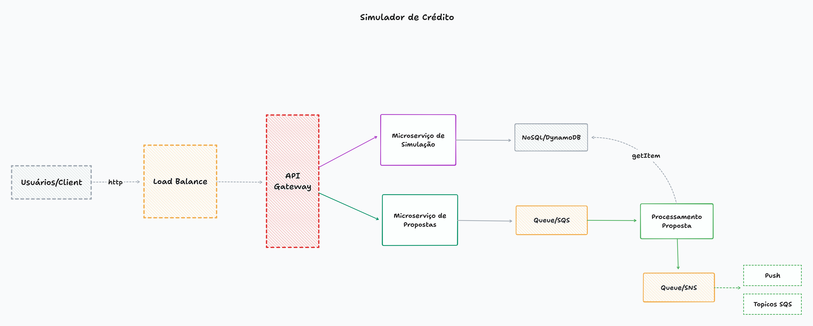

# Arquitetura

## **1. Desenho da Arquitetura**


A arquitetura proposta será baseada em uma abordagem orientada a microserviços para garantir escalabilidade, resiliência e modularidade.

Desenho: https://www.tldraw.com/r/gaGk5LekegVD0uS9U0rFr?d=v-1039.-251.3072.1390.page



### Componentes principais:

- Frontend (UI): Interface amigável para os usuários inserirem dados financeiros e visualizarem simulações e propostas.

- API Gateway: Controla o acesso às APIs internas e gerencia autenticação e autorização.

- Microserviço de Simulação: Calcula os cenários de empréstimos com diferentes taxas de juros e valores de parcela.

- Microserviço de Propostas: Gera propostas personalizadas com base nos resultados da simulação.

### Banco de Dados:

- Relacional (PostgreSQL/MySQL) para dados estruturados como usuários e propostas.

- NoSQL (MongoDB/Redis) para armazenar cálculos temporários ou cache de simulações.

- Mensageria (SQS/SNS): Garante comunicação assíncrona e processamento das propostas.

### Fluxo básico:

- O usuário insere os dados financeiros na UI.

- A API Gateway roteia as solicitações para os serviços apropriados.

- O microserviço de Simulação calcula cenários e retorna os resultados para a UI.

- O microserviço de Propostas gera propostas personalizadas com base na simulação e nos dados adicionais (se necessário obtidos de APIs externas).

## **2. Padrões de Projeto e Boas Práticas**

- Arquitetura Hexagonal: Para organizar a lógica de negócios.

- Circuit Breaker: Garante resiliência ao lidar com falhas em serviços externos.

- Rate Limiting: Previne abuso de APIs.


## **3. Escalabilidade e Resiliência**

- Auto Scaling: Configuração de escalabilidade automática nos microsserviços.

- Load Balancer: Distribui solicitações uniformemente.

- Replicação e Backup: Dados replicados e backups regulares para recuperação de desastres.

- Estratégia de Failover: Permite que outro servidor assuma em caso de falha

## **4. API Design**

Endpoints principais:

`POST /simulate-loan`

Request:

```json
{
  "simulations": [
    {
      "principal": 1000.00,
      "birthDate": "1950-02-22",
      "months": 12,
      "document": "99999999999"
    }
  ]
}
```

Response:

```json
{
  "simulations": [
    {
      "id": "123",
      "monthlyPayment": 85.13,
      "totalInterest": 21.56,
      "totalPayment": 1021.56
    }
  ]
}
```

`POST /generate-proposal`


Request:

```json
{
  "idSimulation": "123"
}
```


Response:

```json
{
  "proposalId": "12345",
  "principal": 1000.00,
  "birthDate": "1950-02-22",
  "months": 12,
  "document": "99999999999",
  "simulations": [
    {
      "monthlyPayment": 85.13,
      "totalInterest": 21.56,
      "totalPayment": 1021.56
    }
  ],
  "status": "APPROVED",
  "creationDate": "2025-01-28T12:34:56Z"
}
```


